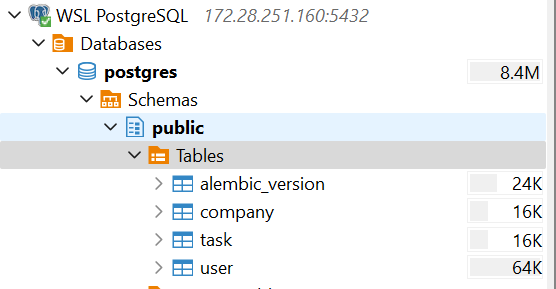
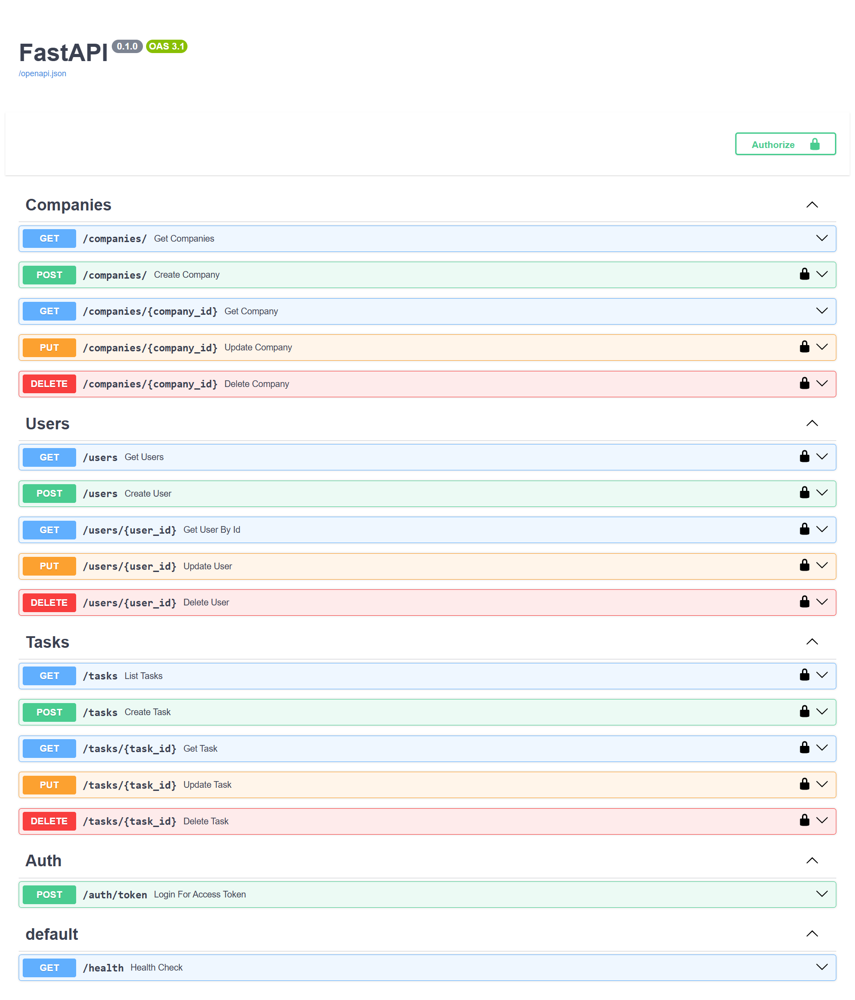
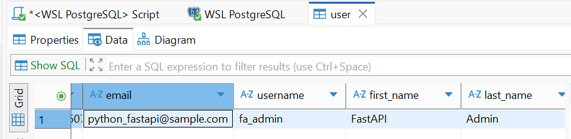

# FastAPI Practice

A small **FastAPI + PostgreSQL** project demonstrating:
- REST API design with **FastAPI**, **APIRouter**, and dependency injection
- Database access via **SQLAlchemy** and migrations with **Alembic**
- Authentication using **OAuth2/JWT**
- CRUD operations for `Company`, `User`, and `Task` entities

## Database Tables

### Company
| Column      | Type       | Description                          |
|-------------|------------|--------------------------------------|
| `id`        | UUID PK    | Unique company ID                    |
| `name`      | String     | Company name                         |
| `description` | Text     | Short description                    |
| `mode`      | String     | Operation mode (e.g., online/offline)|
| `rating`    | Float      | Average rating                       |

### User
| Column         | Type      | Description                                    |
|----------------|-----------|------------------------------------------------|
| `id`          | UUID PK    | Unique user ID                                 |
| `email`       | String     | Email address (unique)                         |
| `username`    | String     | Login username (unique)                        |
| `first_name`  | String     | First name                                     |
| `last_name`   | String     | Last name                                      |
| `hashed_password` | String | Password hash (bcrypt)                         |
| `is_active`   | Boolean    | Whether the user is active                     |
| `is_admin`    | Boolean    | Admin privileges                               |
| `company_id`  | UUID FK    | ForeignKey Company ID                          |

### Task
| Column       | Type       | Description                             |
|--------------|------------|---------------------------------------  |
| `id`         | UUID PK    | Unique task ID                          |
| `summary`    | String     | Short task title                        |
| `description`| Text       | Detailed description                    |
| `status`     | String     | Task status (e.g., pending, done)       |
| `priority`   | Integer    | Priority level (1–5)                    |
| `owner_id`   | UUID FK    | ForeignKey User ID                      |


## Setup

### Create a Python virtualenv and activate it.

```bash
python -m venv .venv
source .venv/bin/activate # on Windows use `.venv\Scripts\activate`
pip install -r requirements.txt
```
### Start development server:

```bash
uvicorn main:app --reload
```

The API will be available at: http://127.0.0.1:8000

Interactive docs:

- Swagger UI: http://127.0.0.1:8000/docs

- ReDoc: http://127.0.0.1:8000/redoc

### Database Setup & Alembic

1. Generate a new Alembic revision

Whenever you add or modify models:

```bash
alembic revision --autogenerate -m "describe your change"
```

This will create a new migration file under app/alembic/versions/.

2. Apply migrations

```bash
alembic upgrade <generate_id>
```

To roll back the last migration:

```bash
alembic downgrade -1
```

Note: Alembic reads its configuration from alembic.ini and app/alembic/env.py.
Ensure target_metadata points to your Base metadata (e.g., from app.db.base import Base).



### Unit test

Run unit test:

```bash
pytest --maxfail=1 --disable-warnings -s -v
```

## API Endpoints Overview

| Method | Path                         | Description                                   |
| ------ | ---------------              | ------------------------ |
| POST   | /auth/token                  | Get JWT access token                          |
| GET    | /users                       | List users (Authorized)                       |
| GET    | /users/{user_id}             | Get current user profile by id (Authorized)   |
| POST   | /users                       | Create new user (Authorized)                  |
| PUT    | /users/{user_id}             | Update a user (Authorized)                    |
| DELETE | /users/{user_id}             | Delete a user (Authorized)                    |
| GET    | /tasks/                      | List tasks (Authorized)                       |
| GET    | /tasks/{task_id}             | Get a task (Authorized)                       |
| POST   | /tasks/                      | Create a new task (Authorized)                |
| PUT    | /tasks/{task_id}             | Update a task (Authorized)                    |
| DELETE | /tasks/{task_id}             | Delete a task (Authorized)                    |
| GET    | /companies                   | List companies                                |
| GET    | /companies/{company_id}      | Get a company                                 |
| POST   | /companies                   | Create company (Authorized)                   |
| PUT    | /companies/{company_id }     | Update company (Authorized)                   |
| DELETE | /companies/{company_id }     | Delete company (Authorized)                   |




### Default Admin User

For convenience, a default admin account is created in the initial seed or migration:

| Field         | Value                                     |
|-------------  |------------ |
| Email         | python_fastapi@sample.com                 |
| Username      | fa_admin                                  |
| Password      | `hash_password(ADMIN_DEFAULT_PASSWORD)`   |
| is_admin      | true                                      |


